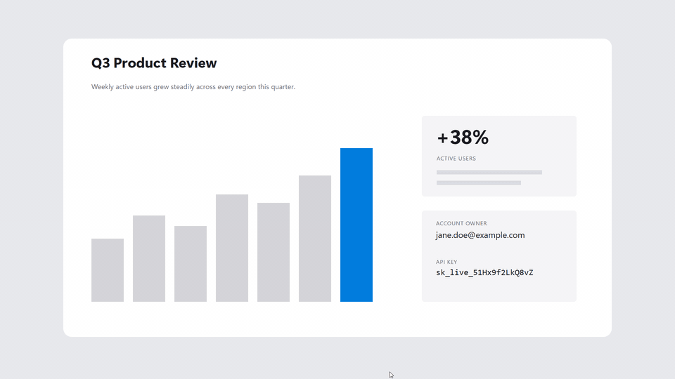
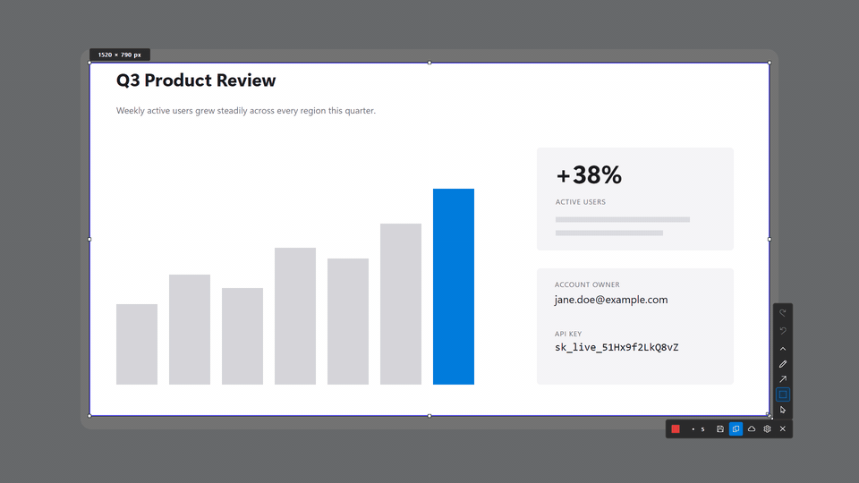
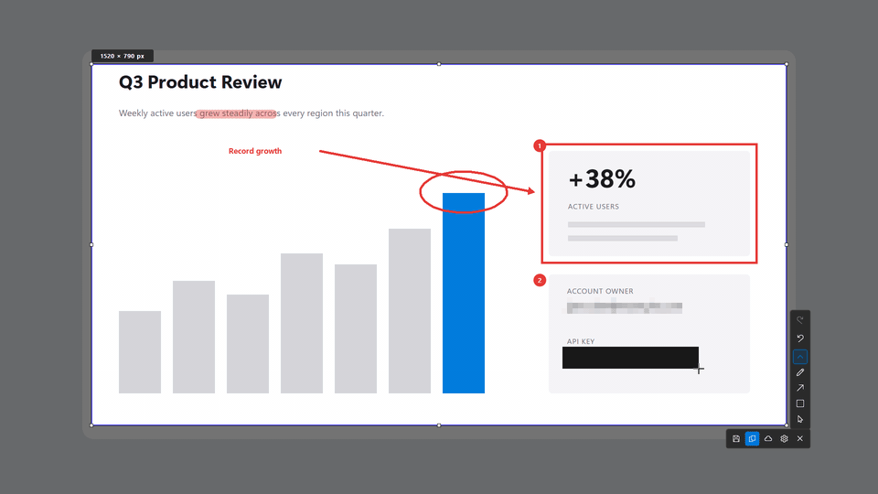
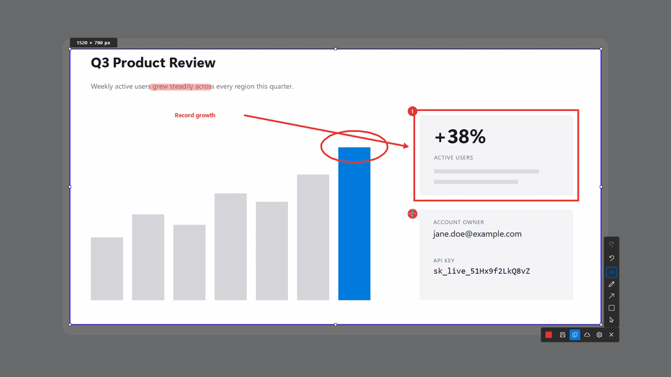
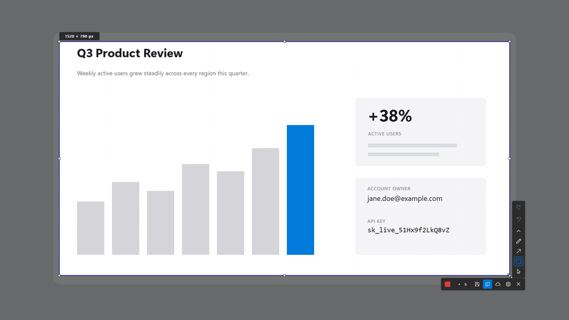

# isolmaSS

**Capture, mark up, share.** A small native Windows screenshot editor written in Rust. Copy or save locally, or get a share link in about a second from a Worker in **your own Cloudflare account**. No central server, no account, no analytics. Version **0.6.2**.

**[Download for Windows 10/11](https://github.com/isolmaz/isolmaSS-app/releases/latest/download/isolmass-setup.exe)** · [Portable ZIP](https://github.com/isolmaz/isolmaSS-app/releases/latest/download/isolmass-portable-windows-x64.zip) · [Website](https://ss.isolmaz.com) · [Guide](docs/GUIDE.md)

## Highlights

- **Instant capture.** PrintScreen freezes every monitor; drag a region or click a window.
- **Eight annotation tools.** Frame, arrow, pen, highlighter, text, auto-numbered steps, blur and opaque redaction.
- **Edit after drawing.** Every shape stays an object: select it to move, resize, recolor, change its width or delete it. Undo and redo cover every edit.
- **Real redaction.** **Redact** (M) replaces pixels with solid dark ones and is applied last, so nothing shows through.
- **One-key sharing.** Ctrl+U uploads to a private Worker in your own Cloudflare account and copies the link. Optional passwords, limits and expiry.
- **Small and native.** One ~1.2 MB executable using Win32 and GDI, per-monitor DPI aware, light and dark themes, signed in-app updates.

## Capture



## Annotate

Each tool has a one-letter shortcut. Color and line width (1–64 px) sit in the toolbar.



## Edit after drawing

Press **V**, click any drawing, then drag it, drag its handles or press Delete. Ctrl+Z brings it back.



## Hide sensitive details

Blur is a visual effect. For secrets use opaque redaction, which cannot be undone in the exported image.



## Share

**Ctrl+C** copies and **Ctrl+S** saves. **Ctrl+U** uploads: the editor closes, and a card shows the link, already on your clipboard.



The first upload connects Cloudflare once: sign in in the browser, approve two permissions, and the app installs a private Worker in your account. Details: [docs/CLOUDFLARE.md](docs/CLOUDFLARE.md).

## Shortcuts

| Key | Action |
|---|---|
| PrintScreen | Capture (configurable, with optional delay) |
| V R A P T H N B M | Select, frame, arrow, pen, text, highlighter, steps, blur, redact |
| Ctrl+C / Enter | Copy |
| Ctrl+S / Ctrl+Shift+S | Save / Save as |
| Ctrl+U | Upload and copy the link |
| Ctrl+Z / Ctrl+Y | Undo / redo |
| Delete | Delete the selected drawing |
| Arrow keys | Nudge the selection or drawing (Shift: 10 px) |
| Esc or right-click | Step back or close |

All shortcuts, settings and file locations: [docs/GUIDE.md](docs/GUIDE.md). The interface is in English and Turkish, follows the Windows display language and can be changed in Settings; the toolbar is icon-only.

## Privacy

- Copy and Save never send anything. Upload goes only to the Worker in the Cloudflare account you chose.
- Worker keys are encrypted with Windows DPAPI; the Cloudflare sign-in token is never stored.
- Updates install only with your consent and only if the publisher signature verifies. See [SECURITY.md](SECURITY.md).

## Build and contribute

Windows x64, Visual Studio C++ Build Tools, Rust 1.98.0 and NSIS.

```powershell
powershell -ExecutionPolicy Bypass -File scripts\check.ps1   # fmt, clippy, tests, Worker syntax
cmd /c package.bat
```

All checks run locally; the repository has no hosted CI.

```text
src/          Rust app: capture, overlay editor, toolbar, annotations, settings, tray, updater, upload
cloudflare/   The per-user share Worker (SQLite Durable Object)
scripts/      Local checks and update signing
resources/    Icon, manifest, pinned update public key
docs/         Guide, Cloudflare reference, README media
```

[CONTRIBUTING.md](CONTRIBUTING.md) · [DISTRIBUTION.md](DISTRIBUTION.md) (releases) · [MIT License](LICENSE) · [Third-party notices](THIRD_PARTY_NOTICES.md)
