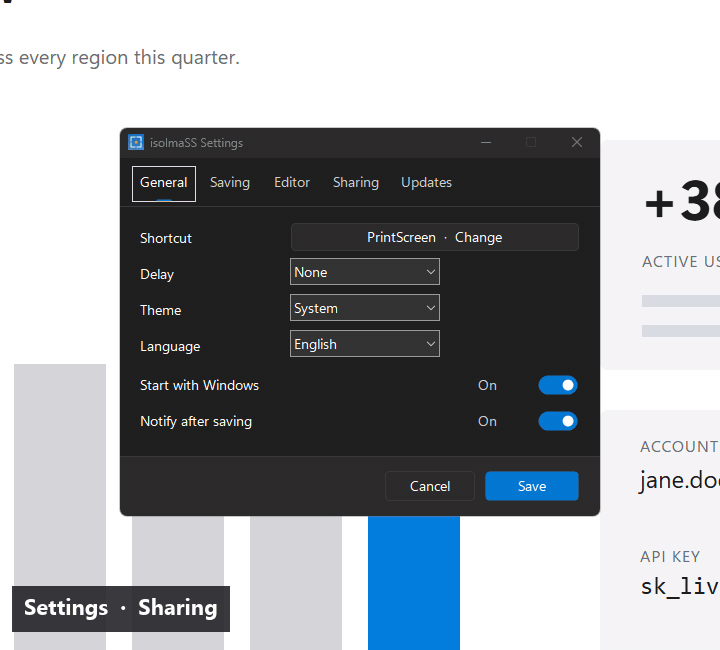

# isolmaSS

[](https://github.com/isolmaz/isolmaSS-app/actions/workflows/ci.yml)

**Screenshot, mark up, share a link — from your own Cloudflare account.**

A small, free Windows screenshot editor. Press PrintScreen, draw on the capture, press Ctrl+U, and about a second later a share link is on your clipboard. The image goes only to a private Worker in **your** Cloudflare account, never to someone else's server.

**[Download for Windows 10/11](https://github.com/isolmaz/isolmaSS-app/releases/latest/download/isolmass-setup.exe)** · [Portable ZIP](https://github.com/isolmaz/isolmaSS-app/releases/latest/download/isolmass-portable-windows-x64.zip) · [Website](https://ss.isolmaz.com) · Version **0.6.3**

## Why isolmaSS

- **Your links stay yours.** Sharing runs on a Worker the app installs in your own Cloudflare account; Cloudflare's free plan is enough. There is no isolmaSS server, account, advertising or analytics.
- **You stay in control.** Delete any link from the app, add a password, and set limits and how long images are kept.
- **Fast.** PrintScreen → drag → Ctrl+U. The link is copied before you switch windows.
- **Drawings stay editable.** Every arrow, frame or text remains an object you can move, resize, recolor or delete.
- **Tiny and native.** One ~1.2 MB Windows program, light and dark themes, English and Turkish, signed updates. Open source (MIT).

## Share from your own Cloudflare

Ctrl+U uploads the capture to your Worker and copies the link. Anyone you send it to can open it in a browser.


The Cloudflare window shows your Worker's usage, sets your limits and lists your images. Deleting an image stops its link at once.



**Setup is a one-time wizard.** The first upload asks you to sign in to Cloudflare in your browser and approve two permissions; the app then creates the Worker for you. You don't paste keys or use a command line. Passwords for new uploads, upload and storage limits, and automatic expiry are built in. Details: [docs/CLOUDFLARE.md](docs/CLOUDFLARE.md).

## Capture

PrintScreen freezes every monitor; drag a region or click a window.


## Annotate

Eight tools, each with a one-letter shortcut: frame, arrow, pen, highlighter, text, numbered steps, blur and opaque redaction. Color and line width (1–64 px) sit in the toolbar.


## Edit after drawing

Press **V**, click any drawing, then drag it, drag its handles or press Delete. Ctrl+Z brings it back.


## Hide sensitive details

Blur is only a visual effect. For secrets use **Redact** (M): it replaces pixels with solid ones and is applied last, so nothing shows through in the exported image.


## Shortcuts

| Key | Action |
|---|---|
| PrintScreen | Capture (configurable, with optional delay) |
| V R A P T H N B M | Select, frame, arrow, pen, text, highlighter, steps, blur, redact |
| Ctrl+C / Enter | Copy |
| Ctrl+S / Ctrl+Shift+S | Save / Save as |
| Ctrl+U | Upload and copy the link |
| Ctrl+Z / Ctrl+Y | Undo / redo |
| Delete | Delete the selected drawing |
| Arrow keys | Nudge the selection or drawing (Shift: 10 px) |
| Esc or right-click | Step back or close |

All shortcuts, settings and file locations: [docs/GUIDE.md](docs/GUIDE.md). The interface follows the Windows display language (English or Turkish) and can be changed in Settings.

## Privacy

- Copy and Save never send anything. Upload goes only to the Worker in the Cloudflare account you chose.
- Worker keys are encrypted with Windows DPAPI; the Cloudflare sign-in token is never stored.
- Updates install only with your consent and only if the publisher signature verifies. See [SECURITY.md](SECURITY.md).

## Build and contribute

Windows x64, Visual Studio C++ Build Tools, Rust 1.98.0 and NSIS.

```powershell
powershell -ExecutionPolicy Bypass -File scripts\check.ps1   # fmt, clippy, tests, Worker syntax
cmd /c package.bat
```

GitHub Actions (`.github/workflows/ci.yml`) runs the same fmt, Clippy, test and Worker syntax checks on every push to `main` and every pull request. Packaging, signing and releases stay local.

```text
src/          Rust app: capture, overlay editor, toolbar, annotations, settings, tray, updater, upload
cloudflare/   The per-user share Worker (SQLite Durable Object)
scripts/      Local checks and update signing
resources/    Icon, manifest, pinned update public key
docs/         Guide, Cloudflare reference, README media
```

[CONTRIBUTING.md](CONTRIBUTING.md) · [DISTRIBUTION.md](DISTRIBUTION.md) (releases) · [MIT License](LICENSE) · [Third-party notices](THIRD_PARTY_NOTICES.md)
